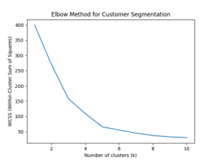
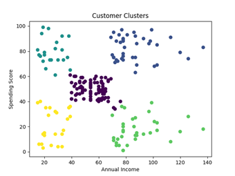

# customer-segmentation-using-machine-learning

## Project Summary
This project applies K-means clustering to segment mall customers based on
their annual income and spending score.  
The goal is to identify distinct customer groups that can support targeted
marketing and customer strategy decisions.

---

## Methodology
- Selected income and spending score as the segmentation space
- Standardized features using StandardScaler
- Determined number of clusters using the Elbow Method (WCSS)
- Applied KMeans with:
  - `k = 5`

---

## Cluster Selection
The elbow point indicates **k = 5**, balancing cluster compactness and simplicity.

---

## Segmentation Results
Customers are grouped into five distinct segments with clear differences in
income and spending behavior.

---

## Business Interpretation
This segmentation enables:
- Identification of high-value customer groups
- More targeted promotions and engagement strategies
- Better alignment between income level and marketing effort

---

## Note

This project was developed as part of my Master of Data Science program, within the
Artificial Intelligence for Data Science course.

## Contact
For any questions, please contact me:

- [LinkedIn](https://www.linkedin.com/in/mashael-alsogair-97b754230/)

Thank you!
